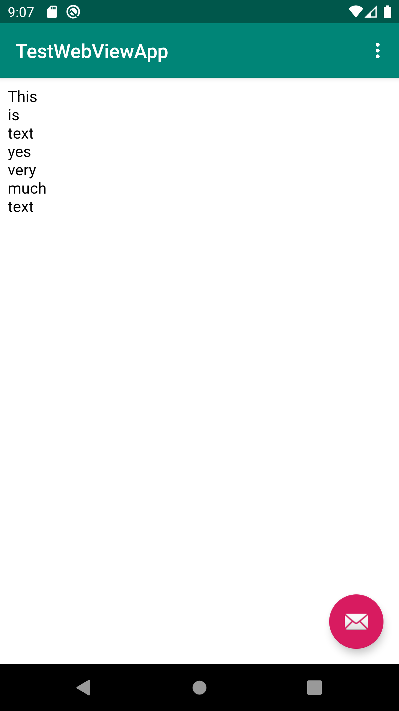

# Rapport

Jag ändrade namnet på appen, sen ändrade jag rättigheter så att appen får tillgång till internet
sedan ändrade jag den textview till en webbview och ändrade några attribut, sedan fick jag en
internal webbsida att funka och efter att ha startat och hela den virituella telefonen så lyckades
jag få external en external webbsida.

såhär fungerar menyn:

'''
@Override
public boolean onOptionsItemSelected(MenuItem item) {
    // Handle action bar item clicks here. The action bar will
    // automatically handle clicks on the Home/Up button, so long
    // as you specify a parent activity in AndroidManifest.xml.
    int id = item.getItemId();

    //noinspection SimplifiableIfStatement
    if (id == R.id.action_external_web) {
        showExternalWebPage();
        return true;
    }

    if (id == R.id.action_internal_web) {
        showInternalWebPage();
        return true;
    }

    return super.onOptionsItemSelected(item);
}
'''

